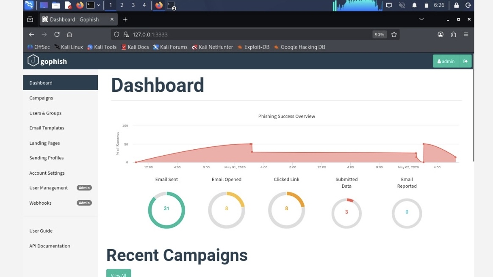
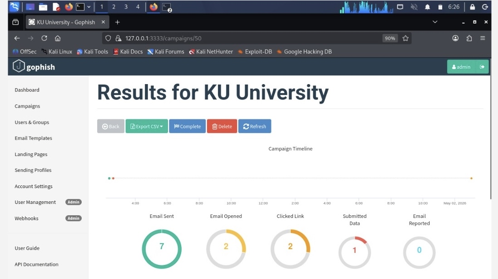

# Results & Test
Project Screenshot and Evidence 

## Screenshot 1

## Screenshot 2

## Screenshot 3

## Screenshot 4
.jpg)

## Screenshot 5
.png)

## Screenshot 6
.jpg)

## Screenshot 7
.jpg)

## Screenshot 8
.jpg)

## Screenshot 9
.jpg)

## Screenshot 10

## Screenshot 11

