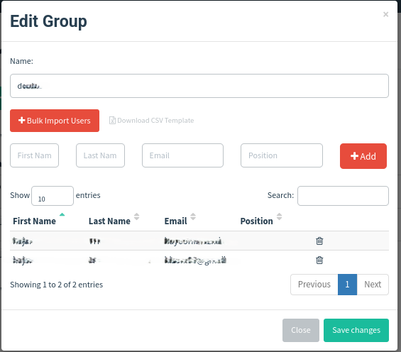
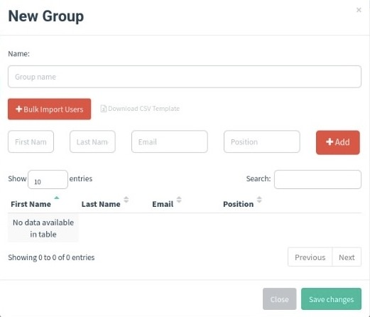

# Steps 

Project Screenshot and Evidence 

## Screenshot 1
.jpg)

## Screenshot 2
.jpg)

## Screenshot 3
.png)

## Screenshot 4
.jpg)

## Screenshot 5
.jpg)

## Screenshot 6
.png)

## Screenshot 7
.jpg)

## Screenshot 8
.jpg)

## Screenshot 9
.png)

## Screenshot 10

## Screenshot 11

## Screenshot 12
.jpg)

## Screenshot 13
.jpg)

## Screenshot 14
.png)

## Screenshot 15
.jpg)

## Screenshot 16
.png)
